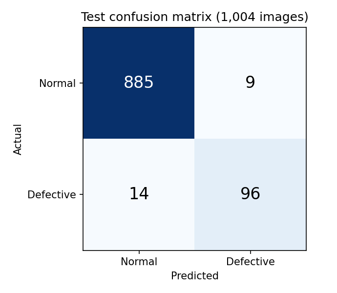
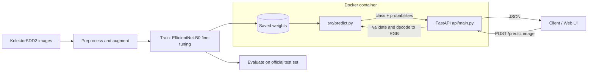
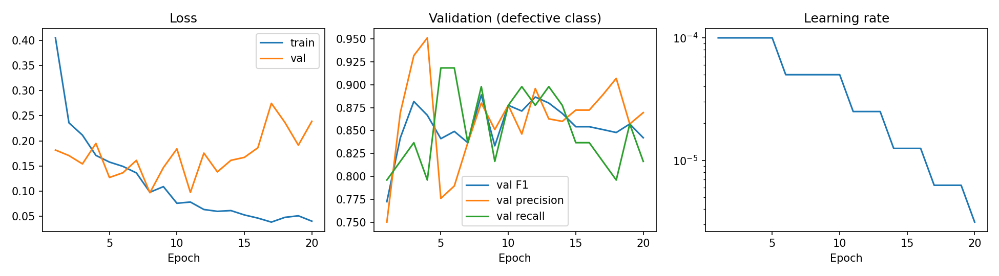
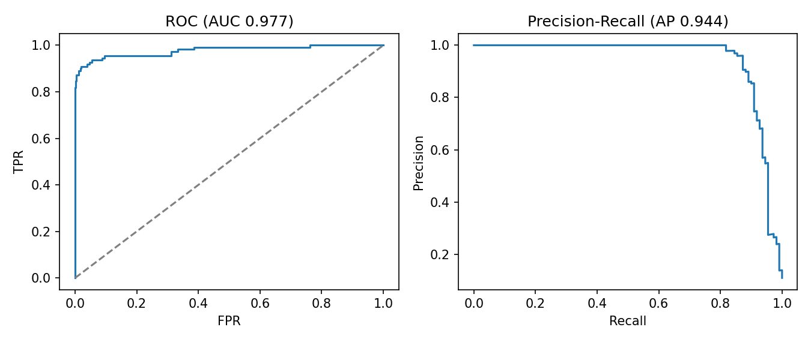

# CV Defect Detection System


A binary visual defect classifier (**normal** vs. **defective**) for industrial surface images, trained on the **KolektorSDD2** dataset. The model is an EfficientNet-B0 fine-tuned with transfer learning in PyTorch, served through a FastAPI inference API with a built-in web UI and Docker deployment.

---

## Table of Contents

1. [Results at a Glance](#results-at-a-glance)
2. [System Architecture](#system-architecture)
3. [Quick Start](#quick-start)
4. [Inference API](#inference-api)
5. [Model Approach](#model-approach)
6. [Dataset Strategy](#dataset-strategy)
7. [Evaluation Results](#evaluation-results)
8. [Evaluation Correction Notice](#evaluation-correction-notice)
9. [Example Predictions](#example-predictions)
10. [Reproducing Training](#reproducing-training)
11. [Known Limitations](#known-limitations)
12. [Roadmap](#roadmap)
13. [Repository Layout](#repository-layout)
14. [Acknowledgements and License](#acknowledgements-and-license)

---

## Results at a Glance

Evaluated on the **1,004 official test images** (110 defective, 894 normal). Defective is the positive class.

| Metric                | Value  |
| --------------------- | ------ |
| Accuracy              | 97.71% |
| Precision             | 91.43% |
| Recall                | 87.27% |
| F1 score              | 0.893  |
| ROC-AUC               | 0.977  |
| Average precision (PR-AUC) | 0.944 |

Because defects are rare (~11% of the test set, ~5% of training data), accuracy alone is misleading. Precision, recall, F1 and PR-AUC are the primary metrics for this project.



---

## System Architecture



Further design notes are in [`architecture.md`](architecture.md).

---

## Quick Start

**Requirements:** Python 3.10+ (3.11 recommended) or Docker.

### Option 1: Run locally

```bash
git clone https://github.com/Maliksarmad01/CV-Defect-Detection-System.git
cd CV-Defect-Detection-System

python -m venv .venv
source .venv/bin/activate        # Windows: .venv\Scripts\activate
pip install -r requirements.txt

# Run from the repository root (the API imports src.predict)
uvicorn api.main:app --host 0.0.0.0 --port 8000
```

| Endpoint        | URL                           |
| --------------- | ----------------------------- |
| Web UI          | http://localhost:8000/        |
| Interactive docs | http://localhost:8000/docs   |
| Health check    | http://localhost:8000/health  |

### Option 2: Run with Docker

```bash
docker build -t defect-api .
docker run -p 8000:8000 defect-api
```

---

## Inference API

| Method | Path       | Description                                              |
| ------ | ---------- | -------------------------------------------------------- |
| GET    | `/`        | Web page for uploading an image                          |
| GET    | `/health`  | Service status                                           |
| POST   | `/predict` | Classify one image (`multipart/form-data`, field `file`) |

**Request**

```bash
curl -X POST -F "file=@sample.png" http://localhost:8000/predict
```

**Response**

```json
{
  "prediction": "Defective",
  "confidence": 99.99,
  "normal_probability": 0.000003,
  "defective_probability": 0.999997
}
```

**Errors**

| Code | Meaning                                                  |
| ---- | -------------------------------------------------------- |
| 400  | Missing, empty, non-image or corrupted file              |
| 500  | Inference failure                                        |

---

## Model Approach

- **Backbone:** EfficientNet-B0 pretrained on ImageNet, with a 2-class head (normal / defective).
- **Training schedule:** 20 epochs, initial learning rate 1e-4, stepped down during training to 1.25e-5 and lower (see the curves below).
- **Model selection:** best validation F1 occurred at **epoch 8** (F1 0.889, precision 0.880, recall 0.898). After that point validation loss rises while training loss keeps falling, which indicates overfitting, so the epoch-8 checkpoint is the recommended one.
- **Why EfficientNet-B0:** small and fast enough for CPU inference, strong accuracy for its size, and simple to deploy.

> **Details to document:** loss function, optimizer, input resolution and augmentation pipeline, and confirmation that the shipped weights are the best-F1 checkpoint. Add them here from your training code.



---

## Dataset Strategy

- **Dataset:** [KolektorSDD2](https://www.vicos.si/resources/kolektorsdd2/), industrial surface-defect images with a binary label per image.
- **Test split:** the official test set of 1,004 images (894 normal, 110 defective, about 11% defective).
- **Class imbalance:** defects make up roughly 5% of training/validation data (estimated from validation counts). This is why the project reports precision, recall, F1 and PR curves rather than accuracy alone.
- **Ground-truth masks:** KolektorSDD2 ships a `*_GT.png` segmentation mask next to every image. These are **not inputs** and must be excluded from training, validation and testing (see the next sections).

> **Details to document:** how imbalance was handled (class weights, sampling, or none) and the train/validation split ratio and method.

---

## Evaluation Results

Test results use real images only (1,004 files, `*_GT.png` masks excluded).

| Metric                            | Value                              |
| --------------------------------- | ---------------------------------- |
| Test images                       | 1,004 (894 normal / 110 defective) |
| True positives / true negatives   | 96 / 885                           |
| False positives / false negatives | 9 / 14                             |
| Accuracy                          | 97.71%                             |
| Precision (defective)             | 91.43%                             |
| Recall (defective)                | 87.27%                             |
| F1 (defective)                    | 0.893                              |
| ROC-AUC                           | 0.977                              |
| Average precision                 | 0.944                              |



Raw files: `reports/test_predictions_images_only.csv`, `reports/confusion_matrix_images_only.csv`.

### Threshold sensitivity

A sample is flagged defective if its probability is at or above the threshold.

| Threshold     | Precision | Recall | False positives | False negatives |
| ------------- | --------- | ------ | --------------- | --------------- |
| 0.1           | 0.813     | 0.909  | 23              | 10              |
| 0.2           | 0.875     | 0.891  | 14              | 12              |
| 0.3           | 0.906     | 0.873  | 10              | 14              |
| **0.5 (default)** | **0.914** | **0.873** | **9**       | **14**          |

Lowering the threshold recovers only a few missed defects at a rising false-alarm cost, so the default of 0.5 is a reasonable operating point. Choose a lower value only if missed defects are costlier than false alarms in your setting.

---

## Evaluation Correction Notice

The original `test_predictions.csv` contained 2,008 rows instead of 1,004. Exactly half were `*_GT.png` mask files labelled "normal", which inflated the normal class (1,898 instead of 894) and produced 1,888 true negatives instead of 885.

| Metric    | Original (with masks) | Corrected (images only) |
| --------- | --------------------- | ----------------------- |
| Precision | 0.906                 | 0.914                   |
| Recall    | 0.873                 | 0.873                   |
| Accuracy  | 98.8%                 | 97.7%                   |

All numbers in this README use the corrected set.

**Possible training contamination.** The validation set size (933) is about 20% of 2 x 2,331 files, which suggests masks may also have been included in training and validation. If so, masks of defective images (which contain a white defect region) were labelled normal. Fix this by filtering them out when listing files:

```python
image_paths = [p for p in all_paths if not p.stem.endswith("_GT")]
```

Retraining after this fix is recommended, and the reported metrics may change.

---

## Example Predictions

Real model outputs from the test set (`reports/test_predictions_images_only.csv`):

| Image       | True label | Prediction | Defective probability | Outcome       |
| ----------- | ---------- | ---------- | --------------------- | ------------- |
| `20209.png` | Defective  | Defective  | 0.99999               | Correct       |
| `20158.png` | Defective  | Defective  | 0.99999               | Correct       |
| `20900.png` | Normal     | Normal     | 0.00011               | Correct       |
| `20770.png` | Normal     | Normal     | 0.00011               | Correct       |
| `20744.png` | Defective  | Normal     | 0.00057               | Missed defect |
| `20816.png` | Defective  | Normal     | 0.00168               | Missed defect |
| `20719.png` | Normal     | Defective  | 0.96540               | False alarm   |
| `20651.png` | Normal     | Defective  | 0.96206               | False alarm   |

To reproduce these through the API, copy the files from `KolektorSDD2/test/` into an `examples/` folder and run the `curl` command from the [Inference API](#inference-api) section.

---

## Reproducing Training

1. Download KolektorSDD2 from the [official source](https://www.vicos.si/resources/kolektorsdd2/) and place it under `data/raw/KolektorSDD2/`.
2. Make sure `*_GT.png` mask files are excluded from all splits.
3. Run training:

```bash
python -m src.train --data_dir data/raw/KolektorSDD2 --epochs 20 --output models/best.pt
```

> Replace the command above with your real entry point and arguments, and state whether trained weights are committed, stored with Git LFS, or downloadable.

---

## Known Limitations

- **Missed defects, some with high confidence.** 14 of 110 defects (12.7%) are missed. 8 of those 14 received a defective probability below 0.05, so the model is confidently wrong on them and a lower threshold will not recover them.
- **False alarms.** 9 of 894 normal images (1.0%) are flagged, and 4 of those score above 0.8.
- **Classification only.** The model reports whether an image is defective, not where. KolektorSDD2 provides masks, so a segmentation model could localize defects.
- **Binary output.** No defect-type information.
- **Single dataset.** Results apply to KolektorSDD2 only. Accuracy will likely drop on other products, lighting, cameras or surface types.
- **Overfitting after epoch ~8.** Validation loss rises while training loss falls. Early stopping on validation F1 is advisable.
- **Small positive class.** With 110 defective test images, one image changes recall by about 0.9 points, so the metrics carry noticeable uncertainty.
- **Possible mask contamination in training.** See the [Evaluation Correction Notice](#evaluation-correction-notice).
- **Serving.** One image per request, no authentication or rate limiting. The 10 MB upload limit is only enforced server-side after applying the fixes described in `main_py_fixes.md`.

---

## Roadmap

- [ ] Retrain with `*_GT.png` masks filtered out and re-report all metrics
- [ ] Add class-weighted loss or weighted sampling for the imbalance
- [ ] Early stopping on validation F1
- [ ] Defect localization (segmentation or Grad-CAM heatmaps)
- [ ] API hardening: authentication, rate limiting, enforced upload size limit
- [ ] Batch inference endpoint
- [ ] Unit and integration tests in CI

---

## Repository Layout

```
api/            FastAPI app and web UI (api/main.py)
src/            Model loading and inference (src/predict.py), training and data modules
models/         Trained weights
notebooks/      Exploration and analysis notebooks
frontend/       Web UI assets
tests/          Tests
docs/           Diagrams and plots
reports/        Corrected evaluation CSVs
architecture.md Design notes
Dockerfile
requirements.txt
```

---

## Acknowledgements and License

- Dataset: **KolektorSDD2**, provided by the ViCoS Lab, University of Ljubljana, and Kolektor Group. Please cite the dataset authors if you use it.
- Backbone: EfficientNet (Tan and Le, 2019), pretrained weights from ImageNet via PyTorch.
- License: add a `LICENSE` file (for example MIT) and state it here.
