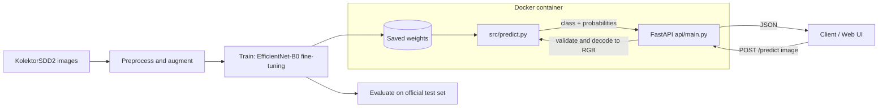

# CV Defect Detection System

Binary visual defect classifier (normal vs. defective) for industrial surface images, trained on **KolektorSDD2**. EfficientNet-B0 transfer learning in PyTorch, served through a FastAPI inference API with a built-in web UI and Docker deployment.

> Items marked `[TODO]` are details I could not verify from your results files. Fill them from your training code.

## Results at a glance

On the 1,004 official test images (110 defective, 894 normal):

| Metric (defective = positive class) | Value |
|---|---|
| Accuracy | 97.71% |
| Precision | 91.43% |
| Recall | 87.27% |
| F1 | 0.893 |
| ROC-AUC | 0.977 |
| Average precision | 0.944 |


## Architecture



## Setup

Requirements: Python 3.10+ (3.11 recommended), or Docker.

```bash
git clone https://github.com/Maliksarmad01/CV-Defect-Detection-System.git
cd CV-Defect-Detection-System
python -m venv .venv
source .venv/bin/activate        # Windows: .venv\Scripts\activate
pip install -r requirements.txt
```

### Run the API locally

Run from the repository root (the API imports `src.predict`):

```bash
uvicorn api.main:app --host 0.0.0.0 --port 8000
```

- Web UI: http://localhost:8000/
- Interactive docs: http://localhost:8000/docs
- Health check: http://localhost:8000/health

### Run with Docker

```bash
docker build -t defect-api .
docker run -p 8000:8000 defect-api
```

## Inference API

| Method | Path       | Description |
|--------|------------|-------------|
| GET    | `/`        | Upload web page |
| GET    | `/health`  | Service status |
| POST   | `/predict` | Classify one image (`multipart/form-data`, field `file`) |

```bash
curl -X POST -F "file=@sample.png" http://localhost:8000/predict
```

```json
{
  "prediction": "Defective",
  "confidence": 99.99,
  "normal_probability": 0.000003,
  "defective_probability": 0.999997
}
```

Errors: `400` for a missing, empty, non-image or corrupted file; `500` for an inference failure.

## Model approach

- **Backbone:** EfficientNet-B0 pretrained on ImageNet, with a 2-class head (normal / defective).
- **Training:** 20 epochs, initial learning rate 1e-4, stepped down during training to 1.25e-5 and lower (see `docs/training_curves.png`).
- **Model selection:** best validation F1 occurred at epoch 8 (F1 0.889, precision 0.880, recall 0.898). Validation loss rises after that point while training loss keeps falling, which indicates overfitting in later epochs, so use the epoch-8 checkpoint. `[TODO: confirm the shipped weights are the best-F1 checkpoint]`
- **Loss, optimizer, input size, augmentation:** `[TODO]`
- **Why this model:** small and fast enough for CPU inference, strong accuracy for its size, simple to deploy.


## Dataset strategy

- **Dataset:** KolektorSDD2, industrial surface-defect images with a binary label per image.
- **Test split:** the official test set, 1,004 images: 894 normal, 110 defective (about 11% defective).
- **Class imbalance:** defects are rare (about 5% of the training/validation data, estimated from the validation counts), which is why plain accuracy is misleading here. Report precision, recall, F1 and PR curves, not accuracy alone. `[TODO: state how imbalance was handled: class weights, sampling, or none]`
- **Train/validation split:** `[TODO: ratio, and confirm it was random]`
- **Ground-truth mask files:** KolektorSDD2 ships a `*_GT.png` segmentation mask next to every image. These are **not** inputs. They must be excluded from training, validation and testing, as described in the next section.

## Evaluation results

The test results are on real images only (1,004 files, `*_GT.png` masks excluded).

| Metric | Value |
|---|---|
| Test images | 1,004 (894 normal / 110 defective) |
| True positives / true negatives | 96 / 885 |
| False positives / false negatives | 9 / 14 |
| Accuracy | 97.71% |
| Precision (defective) | 91.43% |
| Recall (defective) | 87.27% |
| F1 (defective) | 0.893 |
| ROC-AUC | 0.977 |
| Average precision | 0.944 |


Raw files: `reports/test_predictions_images_only.csv`, `reports/confusion_matrix_images_only.csv`.

**Threshold sensitivity** (test set, defective if probability >= threshold):

| Threshold | Precision | Recall | False positives | False negatives |
|---|---|---|---|---|
| 0.1 | 0.813 | 0.909 | 23 | 10 |
| 0.2 | 0.875 | 0.891 | 14 | 12 |
| 0.3 | 0.906 | 0.873 | 10 | 14 |
| 0.5 (default) | 0.914 | 0.873 | 9 | 14 |

Lowering the threshold recovers only a few missed defects at a rising false-alarm cost, so the default 0.5 is a reasonable operating point. Choose a lower one only if missed defects are costlier than false alarms in your setting.

### Important: how the evaluation files were corrected

The original `test_predictions.csv` has 2,008 rows, not 1,004. Exactly half are `*_GT.png` mask files labelled "normal", which inflates the normal class (1,898 instead of 894). The original confusion matrix therefore showed 1,888 true negatives. Removing the masks gives the 885 above. The corrected numbers are slightly lower: precision 0.914 vs 0.906 originally, recall unchanged at 0.873, accuracy 97.7% vs 98.8%. The numbers in this README use the corrected set.

The same pattern appears in the training history. The validation set size (933) is about 20% of 2 x 2,331 files, which suggests masks were also included in training and validation. If so, defective images' masks (which contain a white defect region) were labelled normal. `[TODO: confirm in your data loader.]` Fix by filtering them out when listing files:

```python
image_paths = [p for p in all_paths if not p.stem.endswith("_GT")]
```

Retraining after this fix is recommended, and the reported metrics may change.

## Example predictions

Real model outputs from the test set (`reports/test_predictions_images_only.csv`):

| Image | True label | Prediction | Defective probability | Outcome |
|---|---|---|---|---|
| `20209.png` | Defective | Defective | 0.99999 | Correct |
| `20158.png` | Defective | Defective | 0.99999 | Correct |
| `20900.png` | Normal | Normal | 0.00011 | Correct |
| `20770.png` | Normal | Normal | 0.00011 | Correct |
| `20744.png` | Defective | Normal | 0.00057 | Missed defect |
| `20816.png` | Defective | Normal | 0.00168 | Missed defect |
| `20719.png` | Normal | Defective | 0.96540 | False alarm |
| `20651.png` | Normal | Defective | 0.96206 | False alarm |

Copy these files from `KolektorSDD2/test/` into an `examples/` folder and run the `curl` command above to reproduce them through the API.

## Reproducing training

```bash
# [TODO: replace with your real entry point and arguments]
python -m src.train --data_dir data/raw/KolektorSDD2 --epochs 20 --output models/best.pt
```

Download KolektorSDD2 from the official source `[TODO: add link]` and place it under `data/raw/KolektorSDD2/`. `[TODO: state whether trained weights are committed, stored with Git LFS, or downloadable.]`

## Known limitations

- **Missed defects, some with high confidence:** 14 of 110 defects (12.7%) are missed. 8 of the 14 received a defective probability below 0.05, so the model is confidently wrong on them and a lower threshold will not recover them.
- **False alarms:** 9 of 894 normal images (1.0%) are flagged, and 4 of those score above 0.8.
- **Classification only:** the model reports whether an image is defective, not where the defect is. KolektorSDD2 provides masks, so a segmentation model could localize defects.
- **Binary output:** no defect-type information.
- **Single dataset:** results are for KolektorSDD2 only. Accuracy will likely drop on other products, lighting, cameras or surface types.
- **Overfitting after epoch ~8:** validation loss rises while training loss falls. Early stopping on validation F1 is advisable.
- **Small positive class:** with 110 defective test images, one image changes recall by about 0.9 points, so the metrics carry noticeable uncertainty.
- **Possible mask contamination in training:** see the evaluation section above.
- **Serving:** one image per request, no authentication or rate limiting. The 10 MB limit is enforced server-side only after applying the fixes in `main_py_fixes.md`.

## Repository layout

```
api/main.py                  FastAPI app and web UI
src/predict.py               model loading and inference
src/...                      [TODO: training / data modules]
reports/                     corrected evaluation CSVs
docs/                        diagrams and plots
Dockerfile
requirements.txt
```
